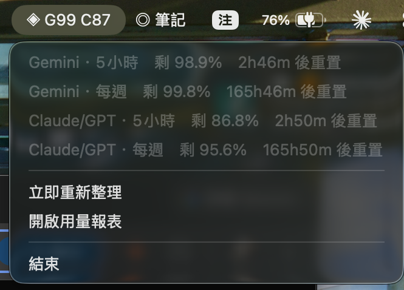

# antigravity-bridge

把 Google Antigravity 當成第二個可程式化驅動的 LLM：分攤工作 + 多方交叉驗證。
**走 Google AI Pro 訂閱額度，不需要 API key、不額外付費。**

## 主線：agy CLI

`~/.local/bin/agy`（v1.1.22），憑證沿用 Antigravity app 的 Google 登入，機器層級 keyring。

```bash
agy -p "提示" --output-format json --model gemini-3.7-flash-high --json-schema schema.json
```

- 解析結果請讀 **`structured_output`** 欄位，**不要讀 `response`**——schema JSON 會漏進 prose。
- `agy models` 看可用模型。跨家族：Gemini 3.7/3.6/3.5 Flash、Gemini 3.1 Pro、
  **Claude Opus 4.6 / Sonnet 4.6**、GPT-OSS 120B。
- 並行時用 `--conversation <id>` 指定對話；`--continue` 抓的是「最近一個」，會互搶。
- 每次呼叫有 ~26–30k input token 底盤（harness 系統提示），續問會走 cache。
- 延遲 2.4s～240s 都出現過，**腳本一定要包 timeout**。

## 工具

### token_report.py — 派工前先看這個
```bash
python3 token_report.py [小時數]
```
一張表看完：Antigravity 兩組配額剩餘 %／重置倒數、每個模型每次呼叫實際吃掉幾 % 配額、
**還能跑幾次**、以及 Claude Code 這邊的消耗對照。

### agy_widget.py — 選單列小工具
```bash
./agy_widget.sh        # 啟動
./agy_widget_stop.sh   # 停止
```
由 launchd 管理（`~/Library/LaunchAgents/com.henry.agy-widget.plist`），**開機自動啟動**，
崩潰會自動重啟。因為有 KeepAlive，停止一定要走 `launchctl unload`，直接 kill 會被拉回來。


選單列上長這樣：`◈ G99 C87` —— G 是 Gemini 組、C 是 Claude/GPT 組的 5 小時窗口剩餘 %。
一眼就知道現在還能不能派工，任一組低於 25% 會變成「⚠︎」。



點開看四個 bucket 的剩餘與重置倒數。上圖那一刻：Gemini 組幾乎沒動（剩 98.9%），
Claude/GPT 組已經用掉 13%（剩 86.8%）——兩者當天的呼叫次數其實差不多，
差距全來自兩組配額的單位成本不同（見下方「派工經濟學」）。

每 5 分鐘抓一次額度時，順手把快照追加進 `quota_history.csv`（長期追蹤的資料來源）。

選單列顯示「◈ G99 C87」＝ Gemini 組／Claude·GPT 組的 5 小時窗口剩餘 %，
任一低於 25% 會變成「⚠︎」。下拉可看四個 bucket 的剩餘與重置倒數，並一鍵開用量報表。

雙定時器：倒數每 2 秒重畫（用快取的 reset_time），`quota()` 每 5 分鐘才真查一次——
查詢會起子行程約 2~4 秒，且必須在背景執行緒跑完後**由主執行緒**套用 UI（AppKit 規定）。

### usage_history.py — 長期追蹤
```bash
python3 usage_history.py [天數]     # 預設 30 天
```
產出 `usage_history.csv`（每日一列），並在終端機印出同樣的表。欄位：
`date, agy_calls, agy_tokens, gemini_quota_used_pct, tp_quota_used_pct,
quota_samples, claude_calls, claude_billable_tokens, claude_cache_read_tokens`

三個來源的性質不同，處理方式也不同：
- **`quota_history.csv`**（選單列小工具每 5 分鐘取樣，一天約 288 筆）——
  額度百分比是**瞬時值**，不當場記就補不回來。當日消耗**不能頭尾相減**（中間會重置），
  要把相鄰樣本的下降量加總，上升＝窗口重置直接略過。
- **`ledger.jsonl`** —— 每次 `run()` 派工的 token 與配額成本。
- **Claude transcripts** —— 已完整落地在 `~/.claude/projects`，**不需取樣**，
  任何時候都能回溯重算，所以歷史資料一開始就是完整的。

### cross_check.py — 同題多模型交叉驗證
```bash
./cross_check.py "要驗證的主張"
./cross_check.py "主張" gemini-3.1-pro-high claude-opus-4-6-thinking
```
並行問多個模型，輸出各自判定／理由／最易忽略前提，結論分歧會標出來。自動記帳。

### 計量模組
- `agy_meter.py` — Antigravity 側。`quota()` 查剩餘（0 token）、`run()` 發話並記帳、
  `ledger()` 讀帳本、`calls()` 掃日誌（**只涵蓋 Anthropic 路徑，Gemini 呼叫日誌不寫用量**，僅供補漏）。
- `claude_meter.py` — Claude Code 側，掃 `~/.claude/projects/**/*.jsonl` 的 `message.usage`，
  以 requestId 去重。Claude 無剩餘額度可查，只記消耗。
- `ledger.jsonl` — 每次 `run()` 前後各拍一次額度快照，記下這次吃掉幾個百分點。校準資料就是這樣來的。

## 實測出來的派工經濟學（2026-08-29 校準）

| 模型 | 每次約 tok | 吃掉 5h 配額 | 一個 5h 窗口約可跑 |
|---|---|---|---|
| gemini-3.7-flash-high | 26k | **0.10%** | **~1,025 次** |
| claude-opus-4-6-thinking | 29k | **3.59%** | **~24 次** |

token 數幾乎一樣，配額成本差 **37 倍**。所以：
- 批量、機械性、可容錯的工作 → 一律 Gemini 組，等於免費
- Claude/GPT 組是稀缺資源，只留給**需要異家族觀點**的交叉驗證，一個窗口約 24 次

## 備援：Python SDK

`~/agy-venv`（Python 3.12，`google-antigravity 0.1.15`）。**只吃 `GEMINI_API_KEY`，用不到 Pro 訂閱額度**，
所以只在需要 CI／多把 key 併行時才用。要用的話在本資料夾放 `.env`（已 gitignore）：
```
GEMINI_API_KEY=你的金鑰
```
`hello_world.py` 是 SDK 版連通測試。

## agy 的權限設定

`~/.gemini/antigravity-cli/settings.json` 的 `permissions.allow` 已加入唯讀指令白名單
（ls / cat / head / tail / grep / rg / find / wc / du / stat / file / git status·log·diff），
所以 headless 派工時他可以自己讀檔，不必把檔案內容貼進提示。
**沒有給任何可寫入的指令**（sed、tee、mv、rm 一律不在名單內）。備份在 `settings.json.bak.20260829`。

實測注意：要他**同時讀多個檔案再產出長程式碼**時出現過 `status: CANCELED` 回空字串。
穩定做法是把介面規格直接寫進提示並註明「不要使用任何工具」，讀檔權限留給單檔查閱型任務。

## 不要送出去的東西

學生照片、課堂逐字稿、未出版教材 → 留本機（mlx-lm / `~/vlm-venv`）。
